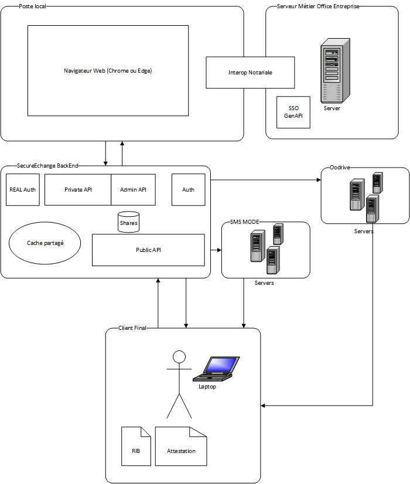
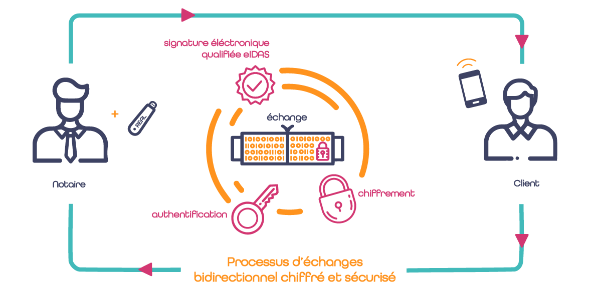

---
# SecureEchange &reg; 

## Envoyez et recevez vos documents en toute sécurité.

Site web : ***[Présentation commerciale](https://www.notasolutions.fr/secure-echange/)***

*Version V1.0, auteur Jacques MASSA, décembre 2023*

---
# Présentation
L'objectif de SecureEchange est de permettre, l'envoi et la réception de documents sensibles en assurant l'origine, l'intégrité et le suivi des actions des documents échangés.  
Pour atteindre cet objectif, SecureEchange met en oeuvre plusieures stratégies :
- Authentification forte de l'office ou l'entreprise qui initie le transfère.
- Authentification à double facteurs du client final qui recoit et expédie des documents.
- Signatures Avancée qualifiée eIDAS des documents demandés.
- Signature Qualifiée eIDAS des documents envoyés par l'office ou l'entreprise qui initie le transfert.
- Chiffrement de tous les documents échangés. 
- ZeroTrust
  >Clé de chiffrement uniquement partagée entre l'office ou l'entreprise initiateur et le client final. **NS SOFT ne possède pas la clé de chiffrement, les fichiers sont illisibles dans les serveurs de NS SOFT.**
- Date de péremption des échanges.
- Intéropérabilité avec les logiciels métiers des notaires.
- Assistance et contrôle d'une IA pour la gestion des IBANs.

SecureEchange se compose des tiers suivants:
- Poste de travail de l'office ou l'entreprise
  - Navigateur + client javascript + Html (Angular) : https://secure-echange.notasolutions.fr
  - Interopérabilité Notariale (Office notarial)
  - Outlook

- Poste de Travail du client final
  - PC:  Edge ou Chrome ou Firefox
  - Mobile: Safari, Chrome

- Back-End
  - APIs (Restfull paradigm)
  - Base de données (NoSQL - Mongo)
  - Cache mémoire partagé (Redis)

- Partenaires
  - LexIA by Lexfluent
  - SMS MODE
  - Oodrive 

## Architecture 
<figure>
</img>
<figcaption>Vue d'ensemble SecureEchange</figcaption>
</figure>
<figure>
</img>
<figcaption>Processus d'échanges bidirectionnel</figcaption>
</figure>

 

Comme on peut le comprendre depuis les schémas ci-dessus, SecureEchange doit interagir avec plusieurs acteurs:
- Les utilisateurs de l'office ou de l'entreprise qui initient les échanges.
- Le logiciel métier (LRA) dans lequel on trouve les fiches clients et les documents à envoyer mais aussi dans lequel on rangera les documents reçus
- SMS Mode pour l'envoi de SMS dans le processus d'authentification à double facteur.
- OODRIVE pour les demandes de signatures électroniques avancées eIDAS.
- LexIA pour la reconnaissance et la vérification des RIBs.
- La clé REAL qui permet une authentification forte grâce à un dispositif physique (clé USB) et code PIN. Et qui permet aussi la signature qualifiée eIDAS des documents PDF.
- La clé AVOCAT qui permet une authentification forte grâce à une dispositif physique (clé USB) et code PIN. Et qui permet aussi la signature qualifiée eIDAS des documents PDF.
- La clé Certinomis qui permet une authentitication forte grâce à un dispositif physique (clé USB) et code PIN. Et qui permet aussi la signature qualifiée eIDAS des documents PDF.
- Le client final qui reçoit les documents envoyés et envoit ceux requis.

Toutes ces interactions doivent s'effectuer de manière à **garantir l'intégrité, l'origine et le suivi des échanges**.  

Afin d'atteindre ces objectifs, SecureEchange a été découpé en plusieurs parties :
- Services d'authentification 
- API privées réservées aux seuls utilisateurs de l'office ou l'entreprise.
- API publiques réservés aux clients destinataires de l'échange.
- L'interopérabilité notariale pour les informations des fiches clients, l'import et le rangement des documents échangés.
- Une application Web réservée aux utilisateurs de l'Office ou l'entreprise
- Une application Web réservée aux clients finaux.

# Sécurisé par Design

## Stratégie sécurité pour les API
SecureEchange consomme de nombreuses API quelles soient privées, publiques, admin. Chaque API expose des points d'entrées qui doivent être sécurisés. 
Pour assurer cette sécurité, nous avons mis en place une stratégie qui s'appuit sur les rôles et les permissions des points d'entrés. 

### Rôles et Permissions
Chaque utilisateur authentifié est représenté par un jeton de type JWT Bearer. Ce jeton contient, en autre, la liste des rôles et des permissions atrribués à l'utilisateur.  
Nous utilisons les rôles pour donner accès au point d'entré. Par exemple, pour entrer dans l'API privé, il faut que l'utilisateur possède a minima le **rôle : SecureEchangeMember** .
Si l'utilisateur possède le rôle prérequis, il peut tenter d'accéder aux différentes méthodes du point d'entré. Ces méthodes exposent leur service sous la forme d'API Restfull respectant le standard OpenAPI. Ce standard s'appuit, a minima, sur les 4 VERBS HTTP : GET, POST, UPDATE, DELETE. 
Pour chacun de ces VERBS, nous exigeons de l'utilisateur une permission spécifique comme définit dans le tableau: 
| Méthode | Description | valeur |
| ----- | -----| ---- |
| <font color="blue">GET | Permission définie dans le jeton SecureEchange | **read:secure_echange** |
 <font color="green">POST | Permission définie dans le jeton SecureEchange | **create:secure_echange** |
|<font color="orange"> PUT | Permission définie dans le jeton SecureEchange | **write:secure_echange** |
| <font color="red">DELETE</font> | Permission définie dans le jeton SecureEchange | **delete:secure_echange** |

Le jeton SecureEchange est généré par l'application après avoir vérifié l'identité de l'utilisateur par l'une des méthodes d'authentification exposées ci-dessus. 
<br>

## Cycle de vie d'un jeton d'authentification

Le cycle de vie d'un jeton SecureEchange peut-être décrit:
1. Création après vérification de l'identité pour **une durée de vie de 4 heures**
2. Si pour le même utilisateur, il existe un jeton SecureEchange plus récent, **tous les anciens jetons sont blacklisted et ne peuvent plus accéder à l'application**. 
3. Si **un même jeton SecureEchange povoque plusieurs erreurs HTTP (401) Unauthorized** en moins de 3 minutes, le jeton est **temporairement blacklisted pour une durée de 6 minutes**. L'utilisateur recoit alors une erreur HTTP **(429) Too many requests**
4. Lorsque **le jeton a expiré**, plus aucune connexion n'est acceptée et l'utilisateur reçoit une erreur HTTP **(401) Unauthorized**. 


## Liste de contrôles d'accès sur les entités

Nous avons vu, dans le paragraphe précèdent, comment l'utilisateur pouvait accéder à l'une des méthodes d'un point d'entré d'une des API. 
L'utilisateur peut exécuter le code contenu dans cette méthode. Parmis les opérations qu'il peut exécuter dans le système d'information, on trouve toutes les opérations du CRUD classique. SecureEchange est une application multi-tenants, il faut donc s'assurer de la séparation des données propres à chaque utilisateur. 
Cette vérification d'accès s'effectue via le paradigm de **Liste de contrôle d'accès (ACL)** que possède chaque entité du système d'information. 
Losque l'utilisatrice Alice execute un requête de demande de la liste des SecureEchange, l'application lui retourne tous les SecureEchange pour lesquels Alice a obtenu le droit de lecture. 
Chaque SecureEchange possède **2 listes de contrôle d'accès: Denied et Granted** .

- ### Denied:
  Cette liste spécifie toutes les entités pour lesquelles, **on a explicitement interdit l'accès** soit en lecture, écriture, création ou suppression .
- ### Granted
  Cette liste spécifie toutes les entités pour lesquelles, **on a explicitement autorisé l'accès** soit en écriture, lecture, création ou suppression.

  La vérification des accès s'effectue dans l'ordre suivant :
  1. Vérification dans la liste des Denied
  2. Si aucun Denied trouvé, vérification dans la liste des Granted
  3. Si aucun Denied trouvé et aucun Granted trouvé et si l'entité a un parent, on vérifie l'accès à l'entité parent. On parle d'héritage des droits d'accès.

Le système des listes contrôle d'accès pour chaque entité et l'utilisation de l'héritage des listes de controle d'accès permet une granularité, une efficacité et une souplesse dans le contrôle d'accès.  Cette stratégie est utilisée dans les systèmes modernes. 

### Exemples de permissions
La liste de contrôle d'accès de La compagnie: 

      "id": "1-0-3-Company-68201628-e03f-4655-bd76-xxxxxxx",
      "permissions": {
          "denied": [],
          "granted": [
              {
                  "principal": "1-0-1-SystemUser",
                  "operation": "All",
                  "resource": "1-0-3-Company-68201628-e03f-4655-bd76-xxxxxxx"
              },
              {
                  "principal": "1-0-2-Member-74647d05-6fcc-4936-9596-yyyyyyy",
                  "operation": "ReadWrite",
                  "resource": "1-0-3-Company-68201628-e03f-4655-bd76-xxxxxxx"
              }
          ]
      },        


   La liste de controle d'accès du Member: 

        "id": "1-0-2-Member-74647d05-6fcc-4936-9596-yyyyyyy",
        "permissions": {
            "denied": [],
            "granted": [
                {
                    "principal": "1-0-1-SystemUser",
                    "operation": "All",
                    "resource": "1-0-2-Member-74647d05-6fcc-4936-9596-yyyyyyy"
                },
                {
                    "principal": "1-0-2-Member-74647d05-6fcc-4936-9596-xxxxxxx",
                    "operation": "ReadWrite",
                    "resource": "1-0-2-Member-74647d05-6fcc-4936-9596-yyyyyyy"
                },
                {
                    "principal": "1-0-3-Company-68201628-e03f-4655-bd76-xxxxxxx",
                    "operation": "ReadWrite",
                    "resource": "1-0-2-Member-74647d05-6fcc-4936-9596-yyyyyyy"
                }
            ]
        },

<br>

# Les services d'authentification

## Authentification par clé REAL
La clé REAL&reg; est un dispositif physique, sécurisée avec un code PIN et contenant un certificat de signature, élaboré par l'ADSN et sous l'autorité du Conseil Supérieur du Notariat qui permet de signer les actes électroniques et s'authentifier pour diverses formalités.  Ce dispositif est disponible pour les notaires et pour les clercs bien que les rôles et permissions soient spécifiques à chaque acteur. Ce dispositif dépend de l'autorité de certification Racine Notaires 20XX, cette autorité est qualifiée eIDAS. 
Son utilisation dans le cadre de l'authentification des notaires et clercs permet une authentification forte des utilisateurs.  
Cependant la profession, préfère que cette clé soit utilisée uniquement dans le cadre des signatures électroniques des actes et des formalités réglementaires. Son utilisation en tant que dispositif d'authentification pour les applications autres que celles réglementaires n'est pas préconisée ou encouragée.  

## Authentification par clé AVOCAT&reg; ou Certinomis&reg;
A l'instar de la clé REAL&reg;, il existe d'autres dispositifs physiques de sécurité disponibles pour les autres professions. 
En particulier, les avocats disposent d'une [clé d'authentification AVOCAT (anciennement e-barreau ou RPVA )](https://dl.avocatparis.org/ebarreau/doc/cle_avocat_V6_2021.pdf) qui peut être utilisée pour s'authentifier et signer électroniquement des documents avec une certification eIDAS. 
Pour tous les professionnels qui ne sont ni Notaire ni Avocat, il est possible d'acquérir un dispositif physique de sécurité équivalent à la clé REAL&reg; ou AVOCAT&reg;, par exemple chez [Certinomis](https://www.certinomis.fr/produit/certinomis-decideur).
L'usage de ces dispositifs de sécurité par l'utilisateur permet d'offrir un moyen fort d'authentification forte pour l'accès à l'application SecureEchange. 


## Authentification par Identifiant et mot de passe (Auth0)
Pour tous les acteurs qui ne possèdent pas de dispositif sécurisé tel que la clé REAL&reg;, nous proposons une authentification basée sur un identifiant et mot de passe avec vérification de l'adresse email. Pour cela, nous mettons en oeuvre une authentification hébergée par [Auth0](https://auth0.com/docs). Cette authentification se base sur OAuth et délivre des Bearer tokens propres à chaque application, utilisateur. Elle intégre les permissions, les rôles par application ainsi que des metadata supplémentaires propre à l'utilisateur (SIRET de la société, identifiant unique, etc... )

## Authentification SSO GenApi&copy; 
GenApi &copy; (aka Septeo Notaires &copy;) est l'éditeur leader français du logiciel de rédaction d'actes pour des notaires. A ce jour, c'est le seul éditeur proposant un SSO d'authentification. Grâce à son SSO, l'utilisateur peut s'authentifier avec son identifant et mot de passe de son outil métier et permet de nous fournir un jeton d'authentification sur lequel nous nous basons, pour autoriser ou non l'accès à l'application SecureEchange. 


# Les API

[Les interfaces de programmation ou Application Programming Interfaces (API)](https://fr.wikipedia.org/wiki/Interface_de_programmation) définissent un ensemble de fonctionnalités indépendantes ou liées qui servent de façade par laquelle un système ou logiciel offre des services à d'autres logiciels.  Les services exposés font abstraction de la complexité de leur fonctionnement et des ressources qu'ils utilisent. Cela permet aux logiciels qui les consomment de se concentrer uniquement sur la fonctionnalité proposée tout en laissant traiter la compléxité aux API. 
Exemple d'API :
[Le modèle Document Object Model (DOM)](https://fr.wikipedia.org/wiki/Document_Object_Model) qui permet la manipulation des objets du document d'une page HTML contenue dans un navigateur. 
Exemple: [height (hauteur) et width (largeur)](https://developer.mozilla.org/fr/docs/Web/API/Document_Object_Model/Examples#exemple_1_height_hauteur_et_width_largeur)

SecureEchange définit des API réparties en plusieurs domaines :
- Authentification 
  - Authentification à partir d'une clé REAL, AVOCAT ou Certinomis permet de générer un Bearer token SecureEchange
  - Authentification à partir d'un token Auth0 permet de générer un Bearer Token SecureEchange
  - Authentification à partir d'un token SSO GenApi permet de générer un Bearer Token SecureEchange
- Fonctionnel
  - Permet de gérer la création, la modification, le traitement et l'archivage des échanges. 
  - la collecte et la restitution des suivi des traitements
  - la gestion des crédits de Signature avancées 
- Administration
  - Permet de gérer la création, la modification, les commandes, la consommation des Offices ou entreprises clientes de SecureEchange

A ce découplage par domaine, il faut appliquer une répartition par acteur. 
- Utilisateur de l'office ou l'entreprise : un jeu d'**API privés**  donne accès à toutes les fonctionnalités pour gérer le cycle de vie des échanges.
- Le client final: un jeu d'**API public**  donne accès à un nombre limité de fonctionnalités qui permettront la récupération des documents et la transmission des documents requis. 
- Les opérateurs du site SecureEchange: un jeu d'**API d'administration** permet la création des offices ou entreprises, la prise en compte des commandes et crédits  de Signature, la gestion des utilisateurs et la remontée de statistiques comptables pour le suivi dans notre ERP. 

Pour la publication de toutes nos API, nous avons choisi d'utiliser le modèle [Swagger RestFull respectant OpenApi V3](https://swagger.io/specification/). 

---
## API privées
Gestion des accès à toutes les fonctionnalités des SecureEchange pour les utilisateurs, de l'office ou l'entreprise, authentifiés. 
Chaque utilisateur authentifié, ne peut gérer que les SecureEchange de l'office ou l'entreprise dont il est un membre reconnu à la suite de son authentification.

### Authentification

#### Prérequis à l'authorisation
Lorsque l'utilisateur se présente pour une authentification utlisant un dispositif physique contenant sont certificat client, nous vérifions les prérequis suivants:

1. L'utilisateur doit avoir **saisi son code PIN** de sa clé pour que l'application est accès au certificat client
2. Le certificat client doit contenir les informations suivantes, en fonction son autorité:
   1. REAL 
      1. **ISSUER** doir être **REAL**
      2. Le CN doit contenir un code **conforme à la spécification du CSN**
   2. Certinomis ou Certigreffe
      1. **ISSUER** doit être **Certinomis ou CertEurope**
      2. Doit contenir l'OID **OID.2.5.4.97** ou le champs **'organizationIdentifier'**
      3. Doit contenir le champs **'Nom RFC822'** ou **'email'**


#### Méthode pour une authentification clé REAL, AVOCAT ou Certinomis
 Méthode | URI | Paramètres | Retour |
 ----- | ---- | -------| ---- |
  <font color="blue">GET |  **/api/clientcertificate** |(query) service, (valeur par défaut) *SecureEchange*<br>**Client Certificate validé par code pin** | **(200) Success:<br> accessToken (SecureEchange Bearer Token),<br>  description,<br>  expireAt,<br>  notBefore,<br>  issuedAt**<br> <BR>(400) Bad Request:<BR>(401) Unauthorized| 

<br>

:lock: Les permissions et roles accordés sont:
1. Role: **SecureEchangeMember**
2. Permissions:
   1. **read:secure_echange**
   2. **write:secure_echange**
   3. **delete:secure_echange**
   4. **create:secure_echange**
<br>

#### Auth0

##### Prérequis à l'authorization

Lorsque l'utilisateur se présente avec un jeton Auth0 valide, nous vérifions plusieurs prérequis pour autoriser la génération un jeton SecureEchange. 
La liste de ces prérequis est: 
1. Le jeton Auth0 doit contenir a minima la **permission: read:secure_echange**.
2. Le jeton Auth0 doit contenir a minima le **role : SecureEchangeMember**
3. **L'email du jeton Auth0 doit avoir été validé** par la procédure Auth0.
4. Le **jeton Auth0** ne doit **pas avoir expiré**.

Si l'un de ces prérequis n'est pas rempli, on retourne une **erreur HTTP (401) Unauthorized**

#### Méthode pour une authentification par identifiant et mot de passe (Auth0)
 Méthode | URI | Paramètres | Retour |
 ----- | ---- | -------| ---- |
  <font color="blue">GET |  **/api/Auth0** |(query) service, (valeur par defaut) *SecureEchange* <br> (headers):exclamation: Authorization: **Bearer Auth0_Access_Token** | **(200) Success:<br>accessToken, (SecureEchange Bearer Token)<br>  description,<br>  expireAt, <br>  notBefore,<br>  issuedAt**<br><br>(400) Bad Request<br> (401) Unauthorized |

<br>

:lock: Les permissions et roles accordés sont:
1.  **Les roles et les permissions définis dans l'administration de AUTH0 et respectant les prérequis**. 

<br>

#### SSO GenApi

##### Prérequis à l'authorization

Lorsque l'utilisateur se présente avec un jeton SSO GenApi, nous vérifions plusieurs prérequis pour autoriser la génération d'un jeton SecureEchange. 
La liste de ces prérequis est :
1. Le jeton SSO GenApi **doit contenir un tenant**
2. Le jeton SSO GenApi **ne doit pas avoir expiré**

Si l'un de ces prérequis n'est pas rempli, on retourne une **erreur HTTP (401) Unauthorized**

##### Méthode pour une authentification avec un jeton SSO GenApi

 | Méthode | URI | Paramètres | Retour |
 | ----- | ---- | -------| ---- |
|  <font color="blue">GET | **/api/iNotCloudAuth** | (query) service, (valeur par defaut) *SecureEchange*<br> (headers):exclamation: Authorization: **Bearer Genapi_Access_Token** | **(200) Success:<br>accessToken, <br>SecureEchange Bearer Token), <br>  description,<br>  expireAt,<br>  notBefore,<br>  issuedAt**<br><br>(400) Bad Request<br> (401) Unauthorized

:lock: Les permissions et roles accordés sont:
1. Role: **SecureEchangeMember**
2. Permissions:
   1. **read:secure_echange**
   2. **write:secure_echange**
   3. **delete:secure_echange**
   4. **create:secure_echange**
<br>


### Fonctionnel
**Toutes les API doivent obligatoirement respecter les régles par défaut suivantes :**
| Régle | Description | valeur |
| ----- | -----| ---- |
| Role obligatoire | Role défini dans le jeton SecureEchange  |  **SecureEchangeMember** |
| Permission obligatoire | Permission défini dans le jeton SecureEchange | **read:secure_echange** |
| Headers obligatoires | Headers de la requête RestFull| **Authorization: Bearer [Access_Token]** |

:lock: Les roles, permissions sont contenues dans le jeton Access_Token SecureEchange généré par les API d'authentification. 
>
#### Liste des permissions :lock: requis pour chaque méthode
| Méthode | Description | valeur |
 ----- | -----| ---- |
 <font color="blue">GET | Permission définie dans le jeton SecureEchange | **read:secure_echange** |
 <font color="green">POST | Permission définie dans le jeton SecureEchange | **create:secure_echange** |
<font color="orange"> PUT | Permission définie dans le jeton SecureEchange | **write:secure_echange** |
 <font color="red">DELETE</font> | Permission définie dans le jeton SecureEchange | **delete:secure_echange** |

#### Share
Cette API permet la création, la modification, la suppression et l'archivage des échanges par les utilisateurs authentifiés en tant membre d'une office ou entreprise existante et active. 
Tous les échanges créés, sont automatiquement attachés à l'office ou l'entreprise. Tous les membres d'un office ou d'une entreprise ont accès aux échanges. Pas forcément à la clé de chiffrement des documents qui réside uniquement sur le poste de l'utilisateur qui a créé l'échange et dans le lien adressé au client final. 

 | Méthode | URI | Paramètres | Retour | Payload |
 | ----- | ---- | -------| ---- | --- |
| <font color="blue">GET</font> | /api/share | | **(200) Success**:<br><br> (400) Bad Request<br> (401) Unauthorized|
| <font color="blue">GET</font> | /api/share/{id}/audits | | **(200) Success**:<br><br> (400) Bad Request<br> (401) Unauthorized <br> (429) Too many request|
| <font color="blue">GET</font> | /api/share/{id}/file/{fileId} ||**(200) Success**:<br><br> (400) Bad Request<br> (401) Unauthorized <br> (429) Too many request|
| <font color="blue">GET</font> | /api/share/{id} ||**(200) Success**:<br><br> (400) Bad Request<br> (401) Unauthorized  <br> (429) Too many request|
| <font color="green">POST</font> | /api/share ||**(200) Success**:<br><br> (400) Bad Request<br> (401) Unauthorized|
| <font color="green">POST</font> | /api/share/{id}/duplicate ||**(200) Success**:<br><br> (400) Bad Request<br> (401) Unauthorized  <br> (429) Too many request|
| <font color="green">POST</font> | /api/share/{id}/file ||**(200) Success**:<br><br> (400) Bad Request<br> (401) Unauthorized  <br> (429) Too many request|
| <font color="green">POST</font> | /api/share/{id}/file/required/file/{index} ||**(200) Success**:<br><br> (400) Bad Request<br> (401) Unauthorized  <br> (429) Too many request|
| <font color="green">POST</font> | /api/share/{id}/audits||**(200) Success**:<br><br> (400) Bad Request<br> (401) Unauthorized  <br> (429) Too many request|
| <font color="red">DELETE</font> | /api/share/{id}||**(200) Success**:<br><br> (400) Bad Request<br> (401) Unauthorized  <br> (429) Too many request|
| <font color="red">DELETE</font> | /api/share/{id}/file/{fileId}||**(200) Success**:<br><br> (400) Bad Request<br> (401) Unauthorized  <br> (429) Too many request|
| <font color="red">DELETE</font> | /api/share/{id}/requiredfiles/{fileId} ||**(200) Success**:<br><br> (400) Bad Request<br> (401) Unauthorized  <br> (429) Too many request|

#### Vérification de la connexion
 | Méthode | URI | Paramètres | Retour | Payload |
 | ----- | ---- | -------| ---- | --- |
| <font color="blue">GET</font> | /api/Auth | |**(200) Success**:<br><br> (400) Bad Request<br> (401) Unauthorized|Propriétés principale de l'utilisateur connecté|

#### Companies

 | Méthode | URI | Paramètres | Retour | Payload |
 | ----- | ---- | -------| ---- | --- |
| <font color="blue">GET</font> | /api/companies/info | |**(200) Success**:<br><br> (400) Bad Request<br> (401) Unauthorized| Propriétés principales de l'office ou l'entreprise |
| <font color="blue">GET</font> | /api/companies/Accounting/Credit | |**(200) Success**:<br><br> (400) Bad Request<br> (401) Unauthorized|Nb Crédits Signature |
| <font color="orange">PUT</font> | /api/companies/info |(body) Propriétés à mettre à jour |**(200) Success**:<br><br> (400) Bad Request<br> (401) Unauthorized|Propriétés de l'office ou l'entreprise mis à jour. <br>:memo: *Uniquemenent le champs Propriétes peut-être mis à jour*|

#### Members
| Méthode | URI | Paramètres | Retour | Payload |
| ----- | ---- | -------| ---- | --- |
| <font color="blue">GET</font> | /api/Members/self | |**(200) Success**:<br><br> (400) Bad Request<br> (401) Unauthorized| Les propriétés principales de l'utilisateur connecté. |
| <font color="orange">PUT</font> | /api/Members |(body) Propriétés à mettre à jour |**(200) Success**:<br><br> (400) Bad Request<br> (401) Unauthorized|Propriétés de l'office ou l'entreprise mis à jour. <br>:memo: *Uniquemenent les champs:<br> Propriétes<br>Firstname<br>Lastname<br>Email<br>peuvent-être mis à jour.*|


---
## API publics
Gére les fonctionnalités d'un SecureEchange pour un client final. Le client finale ne peut que télécharger les documents transmis et téléverser et signer les documents requis.
### Régles et Liste des permissions :lock: 
**Toutes les appels à cette API (sauf ceux de PublicAuth) doivent obligatoirement respecter les régles suivantes :**
| Régle | Description | valeur |
| ----- | -----| ---- |
| Rôle obligatoire | Rôle défini dans le jeton SecureEchange | **SecureEchangeGuest** |
| Permission obligatoire | Permission défini dans le jeton SecureEchange | **read:secure_echange** <br> **write:secure_echange** <br> **delete:secure_echange** |
| Headers obligatoires | Headers de la requête RestFull| **Authorization: Bearer [Access_Token]** |


#### Liste des permissions :lock: requis pour chaque méthode
| Méthode | Description | valeur |
| ----- | -----| ---- |
| <font color="blue">GET</font> | Permission définie dans le jeton SecureEchange | **read:secure_echange** |
| <font color="green">POST<font> | Permission définie dans le jeton SecureEchange | **create:secure_echange** |
| <font color="orange">PUT</font> | Permission définie dans le jeton SecureEchange | **write:secure_echange** |
| <font color="red">DELETE</font> | Permission définie dans le jeton SecureEchange | **delete:secure_echange** |
### Authentification à double facteur 
Lorsque l'utilisateur de l'office ou l'entreprise a créé le SecureEchange, il a inscrit le client final en précisant l'adresse email, le numéro de téléphone et le type de canal de transmission du code de vérification :
1. SMS
1. Message vocal

Processus d'authentification du client final
1. Le client clique sur le lien qu'il a reçu dans sa boite à lettre
2. Dans la page d'authentification, il doit saisir son adresse email
3. Vérification de l'adresse email saisie :
   1. L'adresse email ne fait pas partie des destinataires, on retourne une erreur HTTP (401) Unauthorized
4. L'adresse email a été validée, le client peut recevoir un code en fonction du canal choisi et du numéro de téléphone saisis par l'utilisateur de l'office ou l'entreprise
5. Le client doit saisir le code envoyé sur le numéro de téléphone soit par SMS soit en message vocal.
   1. Le code n'est pas le bon, on retourne une erreur HTTP (401) Unauthorized
6. Le code est validé, le client final accède à son SecureEchange.

L'API qui permet de prendre en charge ce processus est publiée dans le point d'antré PublicAuth.

### PublicAuth

#### Méthodes pour le point d'entrée PublicAuth

| Méthode | URI | Paramètres | Retour | Payload | Action |
| ----- | ---- | -------| ---- | --- | --- |
| <font color="blue">GET</font> | /publicAuth/{id}/SenderCompanyName |(route) id: idenfiant du SecureEchange |**(200) Success**:<br><br>(400) Bad Request<br> | Le nom de l'office ou l'entreprise|
| <font color="blue">GET</font> | /publicAuth/{shareId} | (route) shareId: identifiant du SecureEchange |**(204) No content**:<br><br> (400) Bad Request<br> (404) Not Found<br>| | Vérifie que le SecureEchange existe et n'est pas expiré. |
| <font color="blue">GET</font> | /publicAuth/{shareId}/{email} | (route) shareId: identifiant du SecureEchange <br>(route) email: email à tester pour ce destinataire |**(200) Success**:<br><br> (400) Bad Request<br> (404) Not Found<br> (429) Too many requests|Retourne les éléments pour passer à l'étape 2  | Vérification de l'adresse email |
| <font color="blue">GET</font> | /publicAuth/{shareId}/{email}/sendotp/{method} | (route) shareID: identifiant SecureEchange<br>(route) email: Email validé<br>(route) Method: canal envoi du code SMS ou Vocal |**(204) No Content**:<br><br> (400) Bad Request<br>  (404) Not Found<br>||Envoi le code de vérification par la méthode choisie| 
| <font color="blue">GET</font> |PublicAuth/{shareID}/{email}/verify/{otpPassword}|(route) shareId: identifiant SecureEchange<br>(route) email: email validé<br>(route) otpPassword: code à vérifier |**(200) Success**:<br><br> (400) Bad Request<br>(401) Unauthorized <br>(404) Not Found<br> (429) Too many requests| Retourne le jeton d'auhtentification  |Controle le code de vérification et si ok génére le jeton d'authentification  |

#### Risques identifiés

##### Brute force Email

La méthode: 

```
/PublicAuth/{shareId}/{email} 
```
peut être utilisée dans une attaque de type brute force pour découvrir les adresses emails destinataires du SecureEchange, une fois l'adresse email découverte on pourrait soit tenter une connexion via une attaque brute force sur le code OTP(cf ci-dessous) ou soit contacter le destinataire en se faisant passer pour l'office ou l'entreprise et se faire envoyer et recevoir les documents par un autre moyen. 

Afin d'éviter cette attaque, nous avons mis en place la stratégie suivante :
1. Si dans un délais de 3 minutes, nous détectons plus de 3 tentatives de vérification d'adresse email, **le SecureEchange shareId est blacklisté pour le site Public pendant 6 minutes.** 
2. **Une erreur HTTP (429) avec un header 'Retry-after':360 est retournée.** 

#### Demande de plusieurs code OTP pour le même SecureEchange en quelques minutes

La méthode: 

```
/PublicAuth/{shareID/{email}/sendotp/{method}}
```
peut-être utilisée dans une attaque qui provoquerait l'envoi de plusieurs codes OTP en quelques minutes. Outre le coût des SMS, cela saturerait le mobile de l'utilisateur ou sa messagerie dans le cadre d'appels vocaux. 

Pour limiter ce problème, nous avons adopté la stratégie suivante :
1. Si dans **les 3 minutes après l'envoi d'un premier code OTP, 3 demandes ou plus sont effectués** :
   1. **On marque Blacklisté pour 6 minutes,  le SecureEchange** shareId pour lequel le code OTP a été demandé plusieurs fois.
   2. **Une erreur HTTP (429) avec un header 'Retry-after':360 est retournée.** 

#### Brute force code de validation OTP

La méthode:

``` 
/PublicAuth/{shareId}/{email}/verify/{OtpPassword}
``` 
peut-être utilisée dans une attaque de type brute force pour découvrir le code de validation OTP. Pour limiter le risque, nous avons adopté la stratégie suivante : 
1. Le code OTP Password est valide 3 minutes
2. Si dans les 3 minutes après la création du code OTP, il y a plus de 3 tentatives de vérification de code OTP de ce SecureEchange :
   1. **Le code OTP est supprimé.**
   2. **Le SecureEchange est blacklisté pour le site public pendant 6 minutes.**
   3. **Une erreur HTTP (429) avec un header 'Retry-after':360 est retournée.** 

#### Rôles et permissions :lock: 

Lorsque l'utilisateur a réussi toutes les étapes de l'authentification à double facteurs, les permissions et rôles accordés sont:
1. Role: **SecureEchangeGuest**
2. Permissions:
   1. **read:secure_echange**
   2. **write:secure_echange**
   3. **delete:secure_echange**
<br>

### Share

#### Prérequis à l'autorisation

Lorsque l'utilisateur se présente avec un jeton SecureEchange, nous vérifions plusieurs prérequis . 
La liste de ces prérequis est :
1. Le jeton doit contenir a minima le **rôle : SecureEchangeGuest**
2. Le jeton doit contenir a minima les permissions:
   1. **secure_echange:read**


#### Méthodes pour le point d'entrée Share
| Méthode | URI | Paramètres | Retour | Payload | Action |
| ----- | ---- | -------| ---- | --- | --- |
| <font color="blue">GET</font> | /share/{id} |(route) id: identifiant du SecureEchange |**(200) Success**:<br><br> (400) Bad Request<br>(401) Unauthorized <br>(404) Not Found <br> (429) Too many request|les propriétés du SecureEchange| |
| <font color="blue">GET</font> | /share/{id}/file/{fileId} |(route)id: identifiant du SecureEchange<br>(route) fileId: identifiant du fichier à télécharger| **(200) Success**:<br><br> (400) Bad Request<br>(401) Unauthorized <br>(404) Not Found <br> (429) Too many request|Le fichier encrypté||
| <font color="orange">PUT</font> | /share/{id} |(route) id: identifiant du SecureEchange |**(200) Success**:<br><br> (400) Bad Request<br>(401) Unauthorized <br>(404) Not Found <br> (429) Too many request|Modifie unique le status du SecureEchange  | |
| <font color="orange">PUT<font> | /share/{id}/file/{name}|(route) id: identifiant du SecureEchange<br>(route) name: catégorie du fichier à téléverser<br>(multipart) File |**(200) Success**:<br><br> (400) Bad Request<br>(401) Unauthorized <br>(404) Not Found <br> (429) Too many request|Téléverse le fichier joint| |
| <font color="red">DELETE</font> | /share/{id}/file/{fileId} |(route) id: identifant du SecureEchange<br>(route) fileID: Identifiant du fichier requis à supprimer |**(200) Success**:<br><br> (400) Bad Request<br>(401) Unauthorized <br>(404) Not Found <br> (429) Too many request| Supprime le fichier  |

#### Risques identifiés
##### Tentative d'accès à un autre SecureEchange

Les méthodes suivantes: 
```
Get & Post /share/{id}
Get /share/{id}/file/{fileid}
Post /share/{id}/file/{name}
Delete /share/{id}/file/{fileId}
```
peuvent servir de cible pour atteindre un SecureEchange autre que celui pour lequel on a été autorisé. 
Ce n'est théoriquement pas possible car le SecureEchange ID pour lequel l'utilisateur a été autorisé est contenu dans son token. Et chaque point d'entrée vérifie que le paramètre id correspond bien au SecureEchange ID contenu dans son token. 

:memo: *Dans toutes les méthodes de l'API **PublicAuth** ou **Share**, on pourrait se passer du paramètre id et utiliser celui de son token. Une prochaine révision de l'API prendra en charge cette modification.* 

En l'état actuel, nous avons mis en place la stratédie suivante:
1. Si l'id passé en paramètre est différent de l'ID du SecureEchange contenu dans le token, on **retourne une erreur HTTP (401) Unauthorized**.
2. Si dans un délai de 3 minutes, cette API retourne plus de 10 Unauthorized pour le même token, on **blacklist le token pendant 6 minutes**
3. Si le token est blacklisted,  **Une erreur HTTP (429) avec un header 'Retry-after':360 est retournée.** 


---
## API Admin

Cette API permet d'effectuer l'administration de l'application. 
Celle-ci consiste à :
- Création et/ou modification d'office ou d'entreprise
- Prise en compte de commandes de Crédits de Signature
- Activation/Désactivation d'un office ou une entreprise
- Edition de rapports
  - Consommation de Signatures
  - Liste des Membres connectés
  - Liste des SecureEchange par office ou entreprise

Cette administration est, à ce jour, réservée au seul personnel de NS SOFT qui a accès à l'ensemble des fonctionnalités et de tous les abonnés (office ou entreprise).

Pour y avoir accès, il faut impérativement présenter un jeton Access_Token Auth0 contenant un des rôles :
- SecureEchangeAdmin
- SecureEchangeOperator

### Régles
**Toutes les appels à cette API doivent obligatoirement respecter les régles suivantes :**
| Régle | Description | valeur |
| ----- | -----| ---- |
| Permission obligatoire | Permission défini dans le jeton SecureEchange | **read:secure_echange** |
| Headers obligatoires | Headers de la requête RestFull| **Authorization: Bearer [Access_Token]** |
| Headers obligatoires | Headers de la requête RestFull| **x-api-key** |
| Headers obligatoires | Headers de la requête RestFull| **application-id** |
| Rôle obligatoire | Role défini dans le jeton SecureEchange | **SecureEchangeAdmin**<br>ou<br>**SecureEchangeOperator** |
| Validation | L'email du compte doit avoir été validé par Auth0 | **Email Validated** |

### Liste des permissions 
| Méthode | Description | valeur |
 ----- | -----| ---- |
 <font color="blue">GET | Permission définie dans le jeton SecureEchange | **read:secure_echange** |
 <font color="green">POST | Permission définie dans le jeton SecureEchange | **create:secure_echange** |
<font color="orange"> PUT | Permission définie dans le jeton SecureEchange | **write:secure_echange** |
 <font color="red">DELETE</font> | Permission définie dans le jeton SecureEchange | **delete:secure_echange** |

### Authentification
Il faut impérativement disposer d'un compte identifiant et mot de passe Auth0. Seul NS SOFT peut créer ce compte.  
Seuls les comptes Auth0 ont accès à l'administration de l'application. 

### Admin

| Méthode | URI | Paramètres | Retour | Payload | Action |
| ----- | ---- | -------| ---- | --- | --- |
| <font color="blue">GET</font> | /api/Admin |(Headers) Auth0 **Access_Token**|**(200) Success**:<br><br>(401) Unauthorized ||Vérifie que l'utilisateur est autorisé à se connecter|
| <font color="blue">GET</font> | /api/Admin/whoiam |(Headers) Auth0 **Access_Token**|**(200) Success**:<br><br>(401) Unauthorized |Retour les informations suivantes en fonction de l'utilisateur connecté et autorisé<br>**Name<br>Email<br>UniqueId<br>Client<br>CompanyCode** ||
| <font color="blue">GET</font> | /api/Admin/orders |(Headers) Auth0 **Access_Token**|**(200) Success**:<br><br> Unauthorized|La liste de **toutes les commandes trouvées**||
| <font color="green">POST</font> | /api/Admin/orders |(Headers) Auth0 **Access_Token**<br>(body) **Commande**|**(200) Success**:<br><br> (400) Bad Request<br>(401) Unauthorized|Nouvelle commande|Ajoute une nouvelle commande|
| <font color="orange">PUT</font> | /api/Admin/orders |(Headers) Auth0 **Access_Token**<br>(body) **commande** |**(200) Success**:<br><br> (400) Bad Request<br>(401) Unauthorized|Commande modifiée| Modifie une commande existante|
| <font color="blue">GET</font> | /api/Admin/orders/companies/{companyId} |(Headers) Auth0 **Access_Token**<br>(route) **companyId**: identifiant de la company|**(200) Success**:<br><br> (400) Bad Request<br>(401) Unauthorized <br>(404) Not Found|La liste des commandes de la compagnie référencée par son id||
| <font color="blue">GET</font> | /api/Admin/orders/{id} | (Headers)Auth0 **Access_Token**<br>(route) **id**: identifiant de la commande |**(200) Success**:<br><br> (400) Bad Request<br>(401) Unauthorized|Le détail de la commande référencée par son id ||
| <font color="red">DELETE</font> | /api/Admin/orders/{id} | (Headers)Auth0 **Access_Token**<br>(route) **id**: identifiant de la commande |**(200) Success**:<br><br> (400) Bad Request<br>(401) Unauthorized||Supprime la commande référencée par son id|
| <font color="blue">GET</font> | /api/Admin/articles | (Headers)Auth0 **Access_Token** |**(200) Success**:<br><br> (400) Bad Request<br>(401) Unauthorized|La liste de tous les articles disponibles||
| <font color="blue">GET</font> | /api/Admin/companies |(Headers)Auth0 **Access_Token** |**(200) Success**:<br><br> (400) Bad Request<br>(401) Unauthorized| La liste de toutes les compagnies abonnées actives ou non || 
| <font color="green">POST</font> | /api/Admin/companies | (Headers)Auth0 **Access_Token**<br>(body) **Nouvelle compagnie** |**(200) Success**:<br><br> (400) Bad Request<br>(401) Unauthorized|La nouvelle compagnie créée||
| <font color="orange">PUT</font> | /api/Admin/companies | (Headers)Auth0 **Access_Token**<br>(body) **Compagnie à modifier** |**(200) Success**:<br><br> (400) Bad Request<br>(401) Unauthorized| Compagnie modifiée||
| <font color="blue">GET</font> | /api/Admin/companies/search | (Headers) Auth0 **Access_Token**<br>(query) **criteria**: chaine à rechercher<br>(query) **skip**: nombre d'enregistrement à sauter<br>(query) **top**: nombre d'enregistrement à retourner<br>(query) **isVendor**: filtre sur les compagnies de type fournisseur<br>(query) **deleted**: filtre sur les compagnie marquée en suppression<br>(query) **status**: filtre sur le status Active ou Inactive |**(200) Success**:<br><br> (401) Unauthorized <br>(404) Not Found|La liste des compagnies répondant aux critères de la recherche ||
| <font color="blue">GET</font> | /api/Admin/companies/{id} | (Headers)Auth0 **Access_Token**<br>(route) **id**: identifiant de la compagnie |**(200) Success**:<br><br> (401) Unauthorized <br>(404) Not Found|La compagnie référencée par son id||
| <font color="blue">GET</font> | /api/Admin/companies/{id}/members | (Headers)Auth0 **Access_Token**<br>(route) **id**: identifiant de la compagnie |**(200) Success**:<br><br> (400) Bad Request<br>(401) Unauthorized <br>(404) Not Found|La liste de tous les membres de la compagnie référencée par son id||
| <font color="blue">GET</font> | /api/Admin/companies/siret/{id} | (Headers)Auth0 **Access_Token**<br>(route) **id**: siret de la compagnie |**(200) Success**:<br><br> (400) Bad Request<br>(401) Unauthorized <br>(404) Not Found|La compagnie dont le siret est id||
| <font color="green">POST</font> | /api/Admin/companies/import | (Headers)Auth0 **Access_Token**<br>(multipart) **csvFile**: fichier au format CSV |**(200) Success**:<br><br> (400) Bad Request<br>(401) Unauthorized|Retourne la liste des compagnies| Ajoute en masse des compagnies décrites dans le fichier CSV ci-attaché|
| <font color="blue">GET</font> | /api/Admin/companies/{id}/Accounting/Credit | (Headers)Auth0 **Access_Token**<br>(route) **id**: identifiant de la compagnie  |**(200) Success**:<br><br> (401) Unauthorized|Le crédit de signature restant de la compagnie référencée par son identifiant||
| <font color="blue">GET</font> | /api/Admin/companies/{id}/Accounting/Debit | (Headers)Auth0 **Access_Token**<br>(route) **id**: identifiant de la compagnie   |**(200) Success**:<br><br> (401) Unauthorized|La somme des débits de Crédits de Signatures de la compagnie référencée par son id||
| <font color="blue">GET</font> | /api/Admin/companies/{id}/Accounting/Balance | (Headers)Auth0 **Access_Token**<br>(route) **id**: identifiant de la compagnie   |**(200) Success**:<br><br>Unauthorized|La somme des crédits de Crédits de Signature de la compagnie référencée par son id||


---
## Sites publics et privés
On distingue 2 catégories de sites, l'un privé et l'autre public. 
### Les sites privés
1. Toutes les API consommées par les utilisateurs de l'office ou l'entreprise . 
   1. Authentification
      1. REAL, Certinomis et Certigreffe
      2. Auth0
      3. SSO GenApi
   2. Share
   3. Admin


### Le site public
1. l'API consommé par les clients finaux de l'office ou l'entreprise. 
   1. PublicAuth
   2. Share
   3. Signing
2. le site web en javascript (Angular).


---
## Partenaires

SecureEchange consomme plusieurs services dévlivrés par des partenaires :
1. **SMS Mode** : la gestion des SMS ou textes vocaux
2. **OODRIVE**: les signatures électroniques avancées qualifiées eIDAS
3. **LexIA**: le moteur d'IA de Lexfluent pour la détection, reconnaissance et vérification des IBANs


Toutes ces services sont accessibles via leur API REST depuis les API Publics. Sauf l'application LexIA qui est appelé depuis l'application Javascript afin de ne pas transférer, en clair, le document à analyser à l'infrastructure de SecureEchange. On ne doit jamais accèder au document en clair dans le back-end de SecureEchange. 


---
## Interopérabilité Notariale
Pour les utilisateurs d'un office notarial, la liaison avec leur logiciel de rédaction d'actes (LRA) est assuré par l'interopérabilité Notarial développé par NotaSolutions.  

Ce service est installé sur chaque poste, en local, et s'exécute comme une application Rest API à l'adresse http://localhost:5013 ou http://localhost:5000 .

---
# Architecture Matériel
## Cluster Kubernetes
Notre cluster KUBERNETES est hébergé dans un datacenter à Toulouse chez FullSave (TLS01). 
Il se compose des noeuds suivants :
- 3 noeuds sytèmes
- 6 noeuds de travail CPU
- 1 noeud IA avec 2xGPU NVIDIA TESLA T4 15Go RAM 

## YAMLs
Pour chaque service, on définit: 
- PVC : Définition d'un espace de storage pour les données du POD
- Secrets : mot de passe, identifiants, passphrases etc...
- Deployment : Définition de l'image, des spécifications, des ports exposés etc ...
- Services et nodeport: Service cluster ou Nodeport pour l'accès réseau entre pods.
- Publication HTTPS: pour une publication sur Internet en HTTPS sur le domaine choisi. 

## Construction des images
### AUTH image
```
docker build -f Dockerfile_auth -t xxxxxxx/auth_secure_echange .   
docker push xxxxxxx/auth_secure_echange      
```
### REAL Image
```
docker build -f Dockerfile_real -t xxxxxxx/real_secure_echange .    
docker push xxxxxxx/real_secure_echange   
```

### PUBLIC API & Web Site image (Production)
```
docker build -f Dockerfile_public -t xxxxxxx/public_secure_echange  .
docker push xxxxxxx/public_secure_echange
```

### PUBLIC API & Web Site image (Preproduction)
```
docker build -f Dockerfile_preprod -t xxxxxxx/preprod_public_secure_echange .
docker push xxxxxxx/preprod_public_secure_echange
```

### Privé APIs image
```
docker build -f Dockerfile_internal -t xxxxxxx/internal_secure_echange  .
docker push xxxxxxx/internal_secure_echange
```

### ADMIN image 
```
docker build -f Dockerfile_admin -t xxxxxxx/admin_secure_echange  .
docker push xxxxxxx/admin_secure_echange
```


